# DeployingNodeChaincodeonBlockchainPlatformStarterPlan
Hyperledger is a global, open source, collaborative effort, hosted by The Linux Foundation, to advance cross-industry blockchain technologies. Furthermore, it is a Hyperledger project and framework implementation whose modular architecture powers the IBM Blockchain Platform Starter Plan.

In this pattern, see how to create a network on the IBM Blockchain Platform, install a smart contract (chaincode) onto a peer in the network, and run a sample application to invoke it. You'll see how to populate the shared ledger and communicate with it by making calls from a local client application to query and update the ledger.

The sample application we'll use is called "fabcar" which you will install and run it on the IBM Blockchain Platform Starter Plan on the IBM Cloud. 

When the reader has completed this Code Pattern, they will understand how to:

* Instantiate the IBM Blockchain Platform Starter Plan Service
* [goal 2]
* [goal 3]
* [goal 4]

<!--Remember to dump an image in this path-->


## Flow
<!--Add new flow steps based on the architecture diagram-->
1. Step 1.
2. Step 2.
3. Step 3.
4. Step 4.
5. Step 5.

<!--Update this section-->
## Included components
Select components from [here](https://github.ibm.com/developer-journeys/journey-docs/tree/master/_content/dev#components), copy and paste the raw text for ease
* [IBM Blockchain Service](https://console.bluemix.net/catalog/services/blockchain): The IBM Blockchain platform simplifies your blockchain journey of developing, governing, and operating a network. 
* [Component](link): description

<!--Update this section-->
## Featured technologies
Select components from [here](https://github.ibm.com/developer-journeys/journey-docs/tree/master/_content/dev#technologies), copy and paste the raw text for ease
* [Technology](link): description
* [Technology](link): description

## Pre-requisites
* [IBM Cloud Account](link)
* [Node v6.9.0 or earlier](link)
* [npm](link)

<!--Update this section when the video is created-->
# Watch the Video
[](https://www.youtube.com/watch?v=Jxi7U7VOMYg)

# Steps
Use the ``Deploy to IBM Cloud`` button **OR** create the services and run locally.

## Deploy to IBM Cloud
<!--Update the repo and tracking id-->
[](https://bluemix.net/deploy?repository=https://github.com/IBM/watson-banking-chatbot.git)

1. Press the above ``Deploy to IBM Cloud`` button and then click on ``Deploy``.

<!--optional step-->
2. In Toolchains, click on Delivery Pipeline to watch while the app is deployed. Once deployed, the app can be viewed by clicking 'View app'.


<!--update with service names from manifest.yml-->
3. To see the app and services created and configured for this Code Pattern, use the IBM Cloud dashboard. The app is named `watson-banking-chatbot` with a unique suffix. The following services are created and easily identified by the `wbc-` prefix:
    * wbc-conversation-service
    * wbc-discovery-service
    * wbc-natural-language-understanding-service
    * wbc-tone-analyzer-service

## Manualy deploy to the IBM Cloud

1. [Clone the repo](#1-clone-the-repo)
2. [Create Watson services with IBM Cloud](#2-create-watson-services-with-ibm-cloud)
3. [Import the Conversation workspace](#3-import-the-conversation-workspace)
4. [Load the Discovery documents](#4-load-the-discovery-documents)
5. [Configure credentials](#5-configure-credentials)
5. [Run the application](#6-run-the-application)

<!-- ### 1. Clone the repo

Clone the `DeployingNodeChaincodeonBlockchainPlatformStarterPlan` locally. In a terminal, run:

```
$ git clone https://github.com/IBM/DeployingNodeChaincodeonBlockchainPlatformStarterPlan
```
-->


### 1. Create Blockchain service with IBM Cloud

Whilst use of the IBM Blockchain Platform Starter Plan is currently free whilst the service is in beta, an account is required for logging in. Please note that the Platform is updated often, and the screen shots in this tutorial may not exactly match the ones you see.
Starting on the [Rapidly build with IBM Blockchain Platform](https://console.bluemix.net/developer/blockchain/dashboard) page, select `Service Plans`. Make sure you are logged-in and choose `US South` as the region as at the time of writing Starter Plan is only deployed to that region. Enter `Blockchain-demo` as the Service name, then select `Starter Plan Membership` and click `Create`. 

<!--Remember to dump an image in this path-->
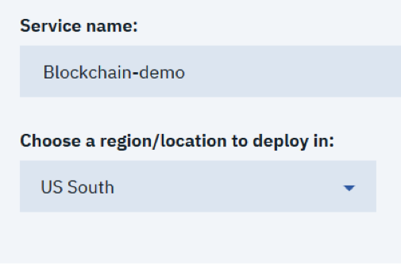

You can now see the “Network created!” screen. Click “Launch” from this screen to see the dashboard for your network.
<!--Remember to dump an image in this path-->
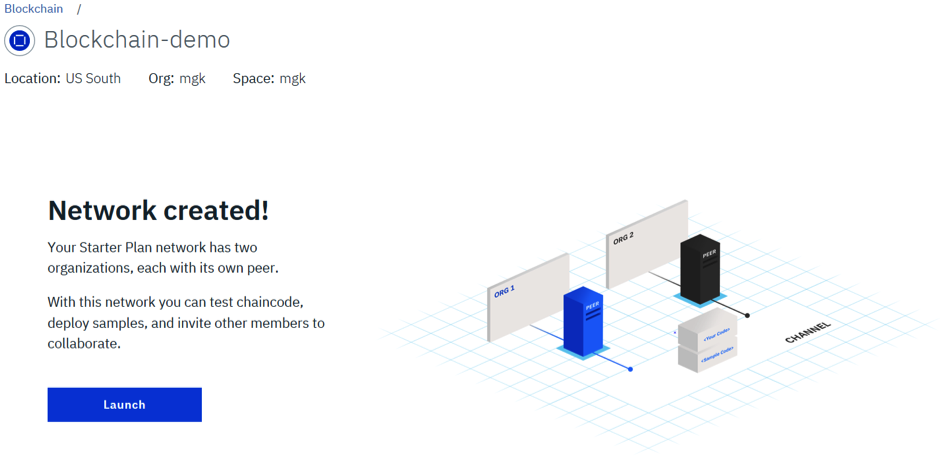

The next screen is the getting started “welcome screen”. Click “Got it” when you have finished reading.
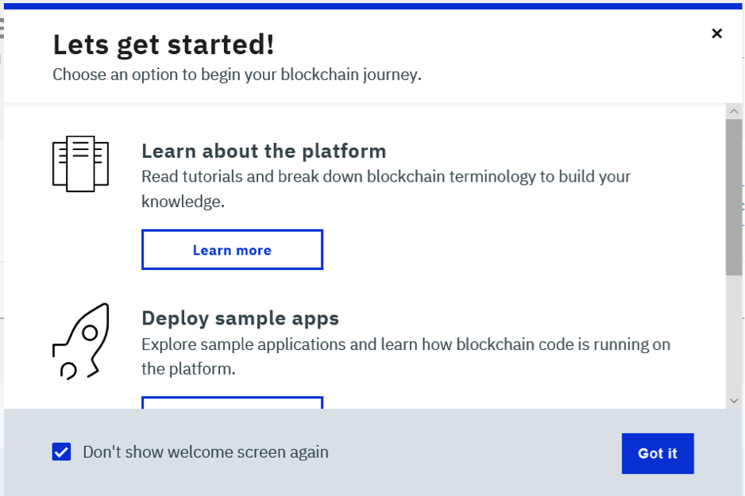

If you look at the top left you will see that your network has been given a generated name. Click on the name and change it to “fabcar”.
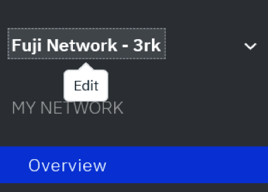
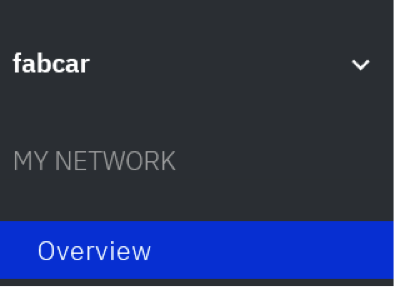

Once you have changed the name you will get a pop-up in the top right for a few seconds informing you that the change has been successful:


Out of the box, Starter Plan creates you a working simple network. If you select the “Overview” tab you can see an overview of what was created for you automatically:
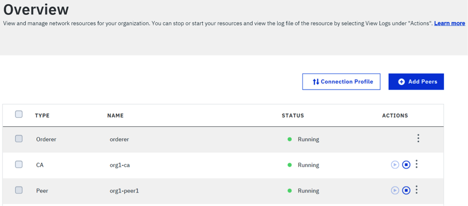

The network actually consists of two organizations Company A (Org1) and Company B (Org2), although you are logged on as Org1 by default and so can only see the “Orderer” service which is shared between both orgs, and a Certificate Authority (CA) and a Peer for “org1”.
If you select the “Members” tab on the left you can see these members in a little more detail:
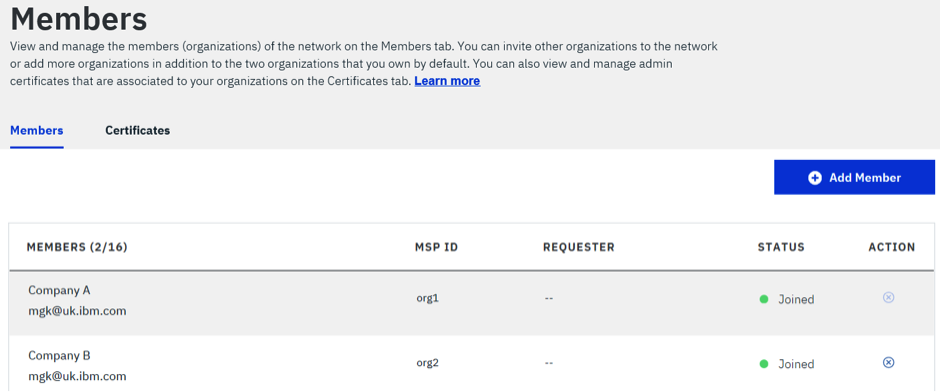

If you select the “Channels” tab on the side you will see that there is also a channel called “defaultchannel” that has been created as well:
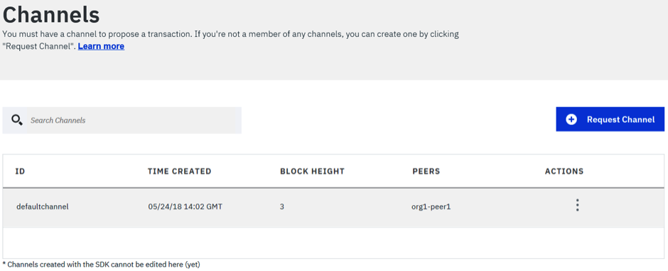

For this tutorial we will use this defaultchannel for simplicity. Click on the “defaultchannel” row in the table to see more details on the channel:


Here you can see that there are already 3 blocks on the chain held by the channel that store the initial configuration information. You can select each row to see more details if you wish.


### 2. Install Chaincode on the Channel

The next step is to deploy the chaincode to the channel and first we have to get the code to install from a github repository using git clone.
In order to complete this next step you will need to have “git” installed on your local machine. Open a command-line or terminal window, navigate to a suitable directory and create a new directory called ‘fabcar’. Navigate to the new ’fabcar’ directory and run the following command to clone the fabric samples source:

```
git clone https://github.com/hyperledger/fabric-samples.git
```

This will copy the code for all the samples to your local machine. Now we have the code we need to deploy it. Using the Starter Plan UI, select the “Install Code” tab from the left hand sidebar to see the “Install code” screen:
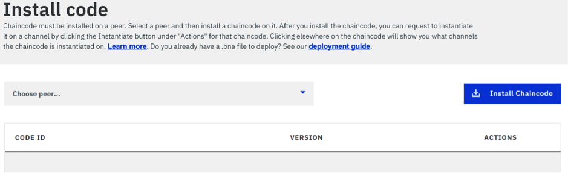

Click the drop-down called “Choose-peer” and select “org1-peer1”. Now click the “Install Chaincode” button.
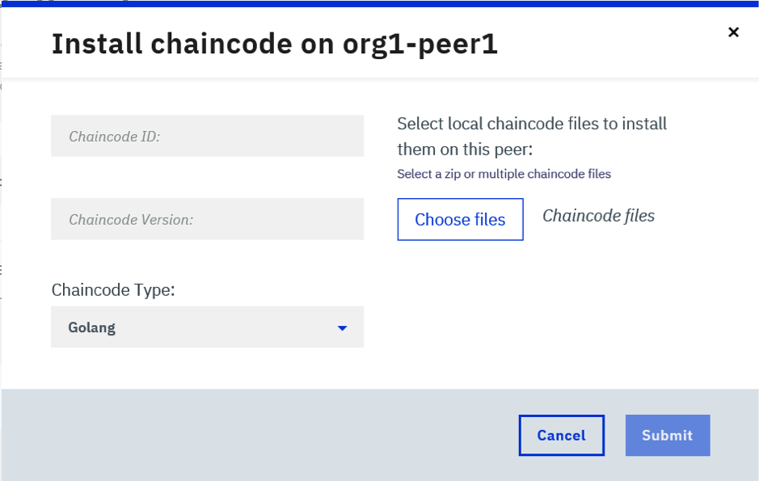

On the ```Install chaincode on org1peer1``` dialog, enter ```fabcar``` for the ```Chaincode ID```, enter ```v1``` for the ```Chaincode Version```.
You have a choice to deploy either the Nodejs or Golang version of the ‘fabcar’ chaincode. Both provide the same functionality, so the choice comes down in part to skills. Choose ```Node``` or ```Golang``` for the ```Chaincode Type```.
Finally, on this screen click “Choose files” to select the chaincode source to install.
If you want to use the go version, select the ```fabcar.go``` chaincode single file from the fabric-samples/chaincode/fabcar/go folder that you downloaded from GitHub. However, if you prefer to use the node version, select both the ```fabcar.js``` file and the ```package.json``` files from the fabric-samples/chaincode/fabcar/node folder that was also downloaded from github.

Example install of the go version of the fabcar chaincode:
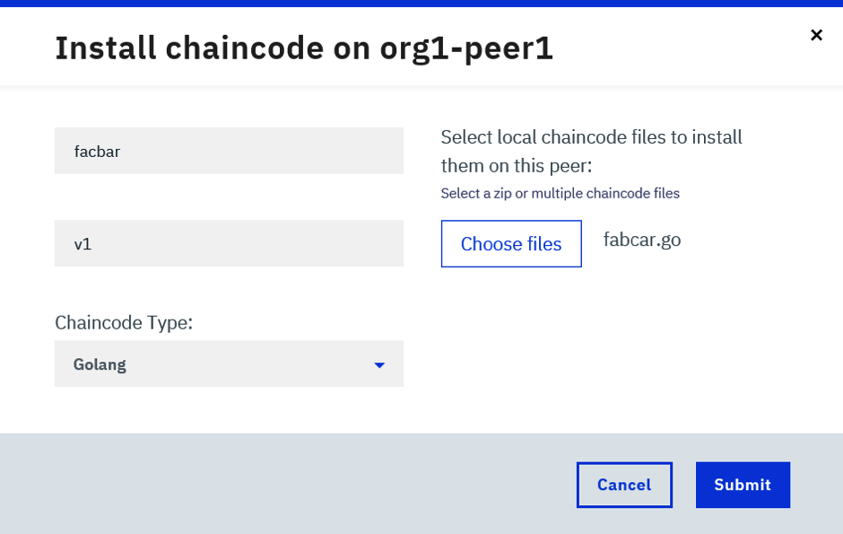


Example install of the node version of the fabcar chaincode:
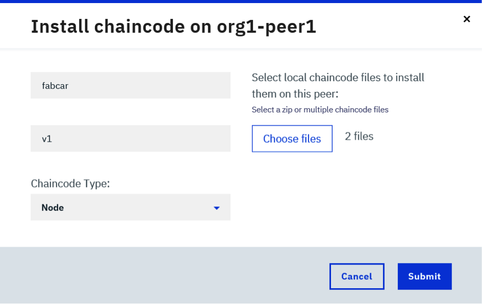

Once you have made your choice, click the Submit button to upload the chaincode to Starter Plan. 
Next you need to instantiate the chaincode. Click on the three dots in the `Actions` column to see the menu and choose `Instantiate`.
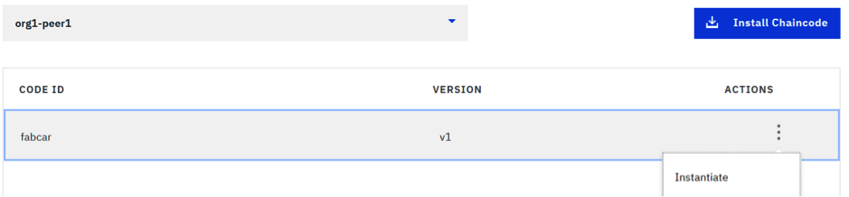

On the ```Instantiate chaincode``` dialog, there are no arguments to provide for fabcar as it does not need any. However, you do need to select ```defaultchannel``` from the ```Channel``` drop-down and match the ```Chaincode Type``` to the language (Node or Golang) of the code you uploaded above. Then click ```Submit```.
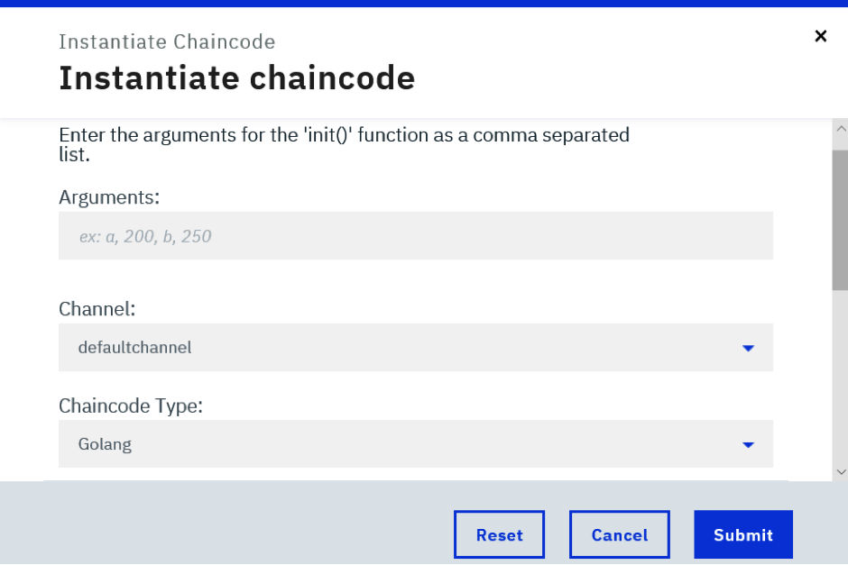

Once this completes, you can select the ```fabcar``` row to see that the chaincode is now instantiated on the defaultchannel:
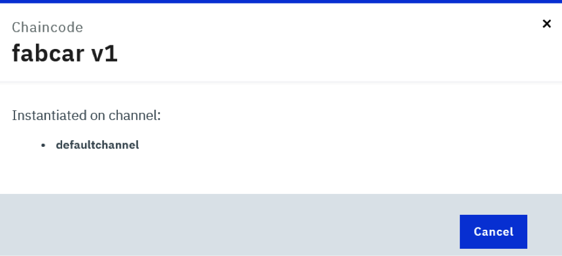

Now the chaincode has been instantiated on the channel, select the Channels side tab and select the ```defaultchannel``` row to see its details:
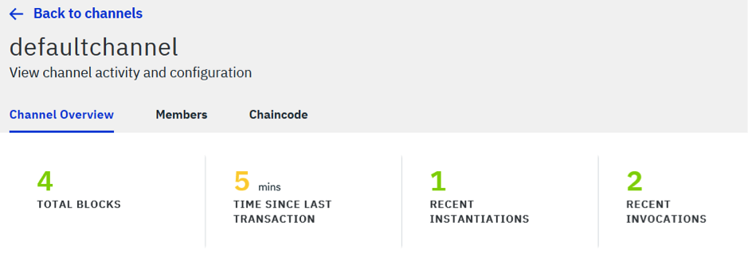

You can now see there is one extra block on the channel which is the record of the instantiate operation we performed above. Now select the ```Chaincode``` tab on this screen and select the ```fabcar``` row to expand it. You can now see two buttons under fabcar:
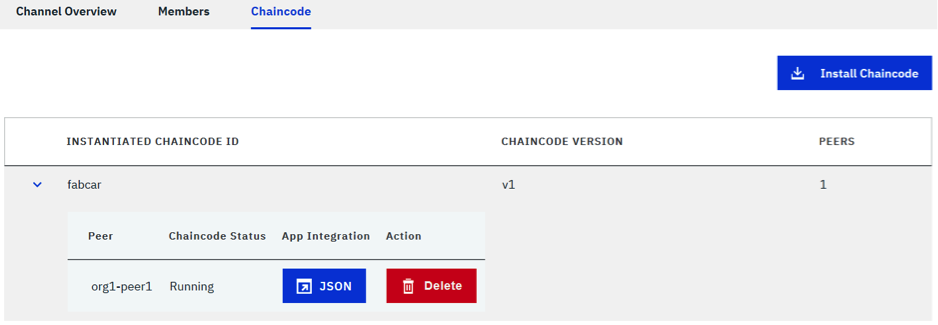

**JSON**: This JSON file holds the credentials and peer information for the blockchain network.

**Delete**: This stops and deletes the chaincode instance.

Next, in the ```fabric-samples/fabcar``` folder that was downloaded from github, create a new folder called ```config```. Click the JSON button shown above, and a new tab will open. Copy all the data shown in this tab into a new file called ```network-profile.json``` and save this file inside the ```fabric-samples/fabcar/config``` folder you just created.

### 3. Configure the application to run on the IBM Blockchain Platform

The fabcar applications you downloaded from github are hard-coded to use a local instance of Fabric. Because we are using Fabric located remotely on IBM Blockchain Platform, this article comes with new versions of the fabcar apps that will connect securely to the remote platform using the ```network-profile.json``` configuration file you just download and saved above. The original four fabcar applications are called:

* enrollAdmin.js
* registerUser.js
* invoke.js
* query.js

The zip file that comes with this article contains new versions of these files called:
* enrollAdminNetwork.js
* registerUserNetwork.js
* invokeNetwork.js
* queryNetwork.js
* 
These new files all end with the word ```Network``` to indicate these are the new versions that will access fabcar remotely and to ensure they will not replace the original files. The zip also contains one extra configuration file called:

* client-profile.json

The ```client-profile.json``` file contains some extra configuration needed to access the remote fabcar chaincode.
Your next step is to extract these files from the zip file and put them into the correct locations. The first four files ending in ‘Network’ should be placed into the ```fabric-samples/fabcar``` folder alongside the original four files from githhub. The ‘client-profile.json’ file should be placed into the ```fabric-samples/fabcar/config``` folder alongside the ```network-profile.json``` file you downloaded and saved earlier.

```Run npm install```

The fabcar client application is written in Node.js. In order to complete this next step, you will need to have ```Node.js``` and ```npm``` installed on your local machine (see pre-requisites). Note that currently Node.js v7 is not supported and you need to use v6.9.0 or earlier. Return to the command-line or terminal window and run the npm install command from within the fabcar folder:

```
cd fabric-samples/fabcar
npm install
```

On Windows, you may need to install the Windows Build Tools if you get build errors:

``` 
npm install --global windows-build-tools
```

All the prerequisite node packages are now installed in order to run the fabcar client application.

**Enrolling an Admin***

When your network was created in Starter Plan, each organisation had an Administrator user called “admin” automatically registered with the Certificate Authority (CA). You now need to send an enrolment request to the CA to retrieve their enrolment certificate (eCert). From within the fabcar folder run:

``` 
node enrollAdminNetwork.js
```

You should see output like this:

```
> node enrollAdminNetwork.js
Found organization: org1 and ca name: org1-ca
Enrolling using enrollmentId: admin and EnrollmentSecret: 2d87ae1b59
Successfully enrolled admin user "admin" with msp: "org1
```

The ```enrollAdminNetwork.js``` application will create a local public/private key pair in a folder it creates called ```hfc-key-store``` and send a Certificate Signing Request (CSR) to the remote CA for org1 to issue the eCert. The eCert, along with some metadata, will also be stored in the ```hfc-key-store``` folder. The connection details of where the CA is located and the TLS certificate needed to connect to it are all obtained by the application from the ```network-profile.json``` you downloaded earlier.

**Enrolling a new user**

Using the eCert for the admin user we will now register and enroll a new user called ```user1``` with the CA. This user will be the one whose identity we will use to update and query the ledger. From within the fabcar folder run: 

```
node registerUserNetwork.js
```

You should see output like this:

```
> node registerUserNetwork.js
Successfully loaded admin from persistence
Successfully registered "user1" - with secret:gTYshgoNxoLH
Successfully enrolled member user "user30" with msp: "org1"
"user1" was successfully registered and enrolled and is ready to interact with the fabric network
```

Like the previous command this application has created a new public/private key pair and sent a CSR request to the CA to issue the eCert for user1. If you look in the ```hlf-key-store``` folder you should see six files, three for each identity.

**Initialize the ledger**

The original fabcar sample from github has a script that automatically calls an ‘initledger’ transaction to populate the ledger with 10 initial vehicles to get you started quickly. Because we are not using this script, we need to call this transaction ourselves. The ‘invokeNetwork.js’ command has been written to call this directly so we can just run this command next:

```
node invokeNetwork.js
```

You should see output that ends like this:

```
…
Successfully committed the change to the ledger by the peer
```

As the chaincode gets run in a separate chaincode docker container, it can take sometime to start this container on first use. If you get a timeout or a ```premature execution``` error, just try running the command again. If you take a look at the ```Channel Overview``` after the command has completed successfully, you should see there is now an extra block on the ledger:
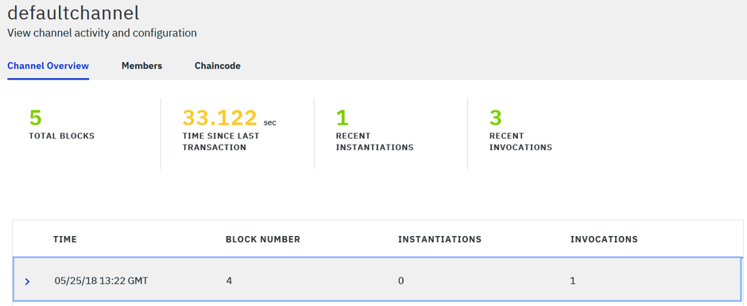


***Query the ledger***

The invokeNetwork.js command has now populated the ledger with sample data for 10 cars, so let's query the ledger to see the data. To do this we are going to run the queryNetwork.js command which is set up to query all cars that exist on the ledger:

```
node queryNetwork.js
```

You should see output like this:

```
> node queryNetwork.js
Successfully loaded user1 from persistence
Query has completed, checking results
Response is  [{"Key":"CAR0", "Record":{"colour":"blue","make":"Toyota","model":"Prius","owner":"Tomoko"}},{"Key":"CAR1", "Record":{"colour":"red","make":"Ford","model":"Mustang","owner":"Brad"}},{"Key":"CAR2", "Record":{"colour":"green","make":"Hyundai","model":"Tucson","owner":"Jin Soo"}},{"Key":"CAR3", "Record":{"colour":"yellow","make":"Volkswagen","model":"Passat","owner":"Max"}},{"Key":"CAR4", "Record":{"colour":"black","make":"Tesla","model":"S","owner":"Adriana"}},{"Key":"CAR5", "Record":{"colour":"purple","make":"Peugeot","model":"205","owner":"Michel"}},{"Key":"CAR6", "Record":{"colour":"white","make":"Chery","model":"S22L","owner":"Aarav"}},{"Key":"CAR7", "Record":{"colour":"violet","make":"Fiat","model":"Punto","owner":"Pari"}},{"Key":"CAR8", "Record":{"colour":"indigo","make":"Tata","model":"Nano","owner":"Valeria"}},{"Key":"CAR9", "Record":{"colour":"brown","make":"Holden","model":"Barina","owner":"Shotaro"}}]
```

**Update the ledger**

Finally, let's make an update to the ledger. To do this, you need to make a simple change to the invokeNetwork.js command.
Open the ```invokeNetwork.js``` file in an editor of your choice such as atom or VSCode, then find and edit the request variable as shown below so that it will invoke the createCar chaincode with a set of arguments that describe the car to be created. The changed request variable should look like this:

```
var request = {
  chaincodeId: 'fabcar',
  fcn: 'createCar',
  args: ['CAR10', 'Honda', 'Accord', 'Black', 'Dave'],
  txId: tx_id
};
```

Save the file and run the edited command again using ```node invokeNetwork.js```. The expected output is: 

```
…
Successfully committed the change to the ledger by the peer.
```

This has created a new Honda vehicle with the owner "Dave" and stored it on the ledger. You can see the new car on the ledger by running the ```queryNetwork.js``` command again as you did before. You can now experiment with creating new cars on the ledger with different names and owners. If you look at the ```Channel Overview``` you should see new blocks added as you create new cars.

Finally, you may want to experiment with the changeOwner transaction to change the owner of a vehicle. To do this, change the request variable in ```invokeNetwork.js``` again to look like this:

``` 
var request = {
  chaincodeId: 'fabcar',
  fcn: 'changeCarOwner',
  args: ['CAR10', 'MGK'],
  txId: tx_id
};
```

Now save the file and run the command again using node invokeNetwork.js. The expected output is: 

```
…
Successfully committed the change to the ledger by the peer
```

You can see the updated owner on the ledger by running the queryNetwork.js command again. You can see the owner of CAR10 has changed from **Dave** to **MGK**.

If you want to query for a single car rather than for all cars, make this change to the request variable in the ```queryNetwork.js``` command and rerun it: 

```
const request = {
  chaincodeId: 'fabcar',
  fcn: 'queryCar',
  args: ['CAR10']
};
```

You should now see the information for a single car:

```
> node queryNetwork.js
Successfully loaded user1 from persistence
Query has completed, checking results
Response is {"colour":"Black","make":"Honda","model":"Accord","owner":"MGK"}
```


## Summary
You now have a running network on the IBM Blockchain Platform Starter Plan, with a sample chaincode deployed to a peer and instantiated on a channel. You also have a running application that you can easily work with locally. You've populated the ledger with sample data, and your application can now communicate (query and update) with the blockchain on the IBM Blockchain Platform. Happy blockchaining!

## Acknowledgments
The authors thank Anthony O'Dowd of the IBM Blockchain Labs Global Engagement team for their expert guidance and support throughout the development of this tutorial.

## Additional Resources
* [Hyperledger Fabric Docs](http://hyperledger-fabric.readthedocs.io/en/latest/)
* [Hyperledger Composer Docs](https://hyperledger.github.io/composer/latest/introduction/introduction.html)

## License
[Apache 2.0](LICENSE)


### 3. Import the Conversation workspace

Launch the **Watson Conversation** tool. Use the **import** icon button on the right

Find the local version of [`data/conversation/workspaces/banking.json`](data/conversation/workspaces/banking.json) and select
**Import**. Find the **Workspace ID** by clicking on the context menu of the new
workspace and select **View details**. Save this ID for later.

*Optionally*, to view the conversation dialog select the workspace and choose the
**Dialog** tab, here's a snippet of the dialog:


### 4. Load the Discovery documents

Launch the **Watson Discovery** tool. Create a **new data collection**
and give the data collection a unique name.

> Save the **environment_id** and **collection_id** for your `.env` file in the next step.

Under `Add data to this collection` use `Drag and drop your documents here or browse from computer` to seed the content with the five documents in `data/discovery/docs`.

### 5. Configure credentials

The credentials for IBM Cloud services (Conversation, Discovery, Tone Analyzer and
Natural Language Understanding), can be found in the ``Services`` menu in IBM Cloud,
by selecting the ``Service Credentials`` option for each service.

The other settings for Conversation and Discovery were collected during the
earlier setup steps (``DISCOVERY_COLLECTION_ID``, ``DISCOVERY_ENVIRONMENT_ID`` and
``WORKSPACE_ID``).

Copy the [`env.sample`](env.sample) to `.env`.

```
$ cp env.sample .env
```
Edit the `.env` file with the necessary settings.

#### `env.sample:`

```
# Replace the credentials here with your own.
# Rename this file to .env before starting the app.

# Watson conversation
CONVERSATION_USERNAME=<add_conversation_username>
CONVERSATION_PASSWORD=<add_conversation_password>
WORKSPACE_ID=<add_conversation_workspace>

# Watson Discovery
DISCOVERY_USERNAME=<add_discovery_username>
DISCOVERY_PASSWORD=<add_discovery_password>
DISCOVERY_ENVIRONMENT_ID=<add_discovery_environment>
DISCOVERY_COLLECTION_ID=<add_discovery_collection>

# Watson Natural Language Understanding
NATURAL_LANGUAGE_UNDERSTANDING_USERNAME=<add_nlu_username>
NATURAL_LANGUAGE_UNDERSTANDING_PASSWORD=<add_nlu_password>

# Watson Tone Analyzer
TONE_ANALYZER_USERNAME=<add_tone_analyzer_username>
TONE_ANALYZER_PASSWORD=<add_tone_analyzer_password>

# Run locally on a non-default port (default is 3000)
# PORT=3000

```

### 6. Run the application
1. Install [Node.js](https://nodejs.org/en/) runtime or NPM.
1. Start the app by running `npm install`, followed by `npm start`.
1. Use the chatbot at `localhost:3000`.
> Note: server host can be changed as required in server.js and `PORT` can be set in `.env`.

<!--Add a section that explains to the reader what typical output looks like, include screenshots -->

# Sample output


<!--Include any troubleshooting tips (driver issues, etc)-->

# Troubleshooting

* Error: Environment {GUID} is still not active, retry once status is active

  > This is common during the first run. The app tries to start before the Discovery
environment is fully created. Allow a minute or two to pass. The environment should
be usable on restart. If you used `Deploy to IBM Cloud` the restart should be automatic.

* Error: Only one free environent is allowed per organization

  > To work with a free trial, a small free Discovery environment is created. If you already have
a Discovery environment, this will fail. If you are not using Discovery, check for an old
service thay you may want to delete. Otherwise use the .env DISCOVERY_ENVIRONMENT_ID to tell
the app which environment you want it to use. A collection will be created in this environment
using the default configuration.

<!--Include any relevant links-->

# Links
* [Demo on Youtube](https://www.youtube.com/watch?v=Jxi7U7VOMYg)
* [Watson Node.js SDK](https://github.com/watson-developer-cloud/node-sdk)
* [Relevancy Training Demo Video](https://www.youtube.com/watch?v=8BiuQKPQZJk)
* [Relevancy Training Demo Notebook](https://github.com/akmnua/relevancy_passage_bww)

<!-- pick the relevant ones from below -->
# Learn more

* **Artificial Intelligence Code Patterns**: Enjoyed this Code Pattern? Check out our other [AI Code Patterns](https://developer.ibm.com/code/technologies/artificial-intelligence/).
* **Data Analytics Code Patterns**: Enjoyed this Code Pattern? Check out our other [Data Analytics Code Patterns](https://developer.ibm.com/code/technologies/data-science/)
* **AI and Data Code Pattern Playlist**: Bookmark our [playlist](https://www.youtube.com/playlist?list=PLzUbsvIyrNfknNewObx5N7uGZ5FKH0Fde) with all of our Code Pattern videos
* **With Watson**: Want to take your Watson app to the next level? Looking to utilize Watson Brand assets? [Join the With Watson program](https://www.ibm.com/watson/with-watson/) to leverage exclusive brand, marketing, and tech resources to amplify and accelerate your Watson embedded commercial solution.
* **Data Science Experience**: Master the art of data science with IBM's [Data Science Experience](https://datascience.ibm.com/)
* **PowerAI**: Get started or get scaling, faster, with a software distribution for machine learning running on the Enterprise Platform for AI: [IBM Power Systems](https://www.ibm.com/ms-en/marketplace/deep-learning-platform)
* **Spark on IBM Cloud**: Need a Spark cluster? Create up to 30 Spark executors on IBM Cloud with our [Spark service](https://console.bluemix.net/catalog/services/apache-spark)
* **Kubernetes on IBM Cloud**: Deliver your apps with the combined the power of [Kubernetes and Docker on IBM Cloud](https://www.ibm.com/cloud-computing/bluemix/containers)

<!--keep this-->

# License
[Apache 2.0](LICENSE)